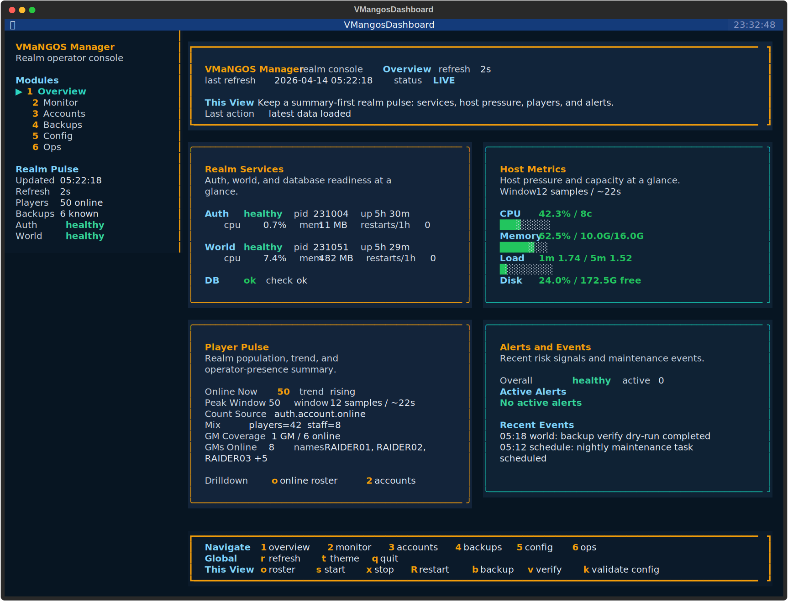

# VMANGOS Manager

VMANGOS Manager gives VMaNGOS servers something they usually do not get: a real operator experience. It automates host installation, provisions the moving pieces around the realm, and puts a live terminal dashboard on top instead of expecting admins to live in scattered shell commands.



This screenshot is a real, demo-backed dashboard export generated from the Manager TUI.

## Why It Exists

- VMaNGOS has powerful server software but a thin operator surface.
- New hosts take real setup work, and existing hosts usually accrete fragile local scripts.
- Manager makes installation, monitoring, and day-two operations feel like one product instead of a pile of disconnected chores.

## What You Get

### Install Automation

For a fresh Ubuntu 22.04 host, the repo ships an installer flow that provisions VMANGOS, configures databases, lays out runtime paths, and can provision Manager itself under `/opt/mangos/manager`.

Automated install:

```bash
wget https://raw.githubusercontent.com/tonymontoya/VMANGOS-Manager/main/auto_install.sh
wget https://raw.githubusercontent.com/tonymontoya/VMANGOS-Manager/main/vmangos_setup.sh
sudo bash auto_install.sh
```

Guided install:

```bash
wget https://raw.githubusercontent.com/tonymontoya/VMANGOS-Manager/main/vmangos_setup.sh
sudo bash vmangos_setup.sh
```

The installer handles:

- dependency installation and long-build orchestration
- database creation and credentials
- config generation
- client data staging
- manager provisioning
- dashboard prerequisites for fresh installs

If you want the fuller installer story, use the [install automation guide](docs/install-automation.md).

### The Dashboard

The dashboard is the main selling point of Manager. It is a top-style operational view backed by the same Manager JSON status surfaces used by the CLI, so the TUI is not a disconnected monitoring toy.

Bootstrap once on a host where Manager is already installed:

```bash
sudo /opt/mangos/manager/bin/vmangos-manager dashboard --bootstrap
```

Launch it:

```bash
sudo /opt/mangos/manager/bin/vmangos-manager dashboard --refresh 2
```

The dashboard surfaces:

- auth/world service health, PID, uptime, and quick actions
- host CPU, memory, disk, load, and disk I/O
- online player visibility plus per-player detail
- alerts, recent events, and log rotation health

## Two Good Starting Paths

### Fresh Host

Use the installer scripts and let Manager come in as part of the host provisioning flow.

```bash
sudo bash auto_install.sh
```

### Existing VMANGOS Host

Install Manager, detect your config, then bootstrap the dashboard:

```bash
cd manager
make test
sudo make install PREFIX=/opt/mangos/manager
sudo /opt/mangos/manager/bin/vmangos-manager config detect
sudo /opt/mangos/manager/bin/vmangos-manager dashboard --bootstrap
sudo /opt/mangos/manager/bin/vmangos-manager dashboard --refresh 2
```

## Quick Start

Install Manager from a source checkout:

```bash
git clone https://github.com/tonymontoya/VMANGOS-Manager.git
cd VMANGOS-Manager/manager
make test
sudo make install PREFIX=/opt/mangos/manager
```

Or:

```bash
sudo ./manager/install_manager.sh --run-tests
```

Then:

```bash
sudo /opt/mangos/manager/bin/vmangos-manager dashboard --bootstrap
sudo /opt/mangos/manager/bin/vmangos-manager dashboard --refresh 2
```

## What Manager Covers Behind The UI

- server control and richer status output
- backup and restore workflows
- maintenance scheduling
- update planning and apply flows
- account management
- config detection for existing installs

## Documentation

- [Install automation](docs/install-automation.md)
- [CLI reference](docs/cli-reference.md)
- [Troubleshooting](docs/troubleshooting.md)
- [Security notes](docs/security.md)
- [Research notes](docs/research)

If you want command-by-command detail, use the CLI reference instead of the README.

## VMaNGOS Context

VMaNGOS is an independent continuation of the Elysium/LightsHope codebases focused on accurate Vanilla WoW content progression across patch eras from 1.2 through 1.12.1.

## Resources

- [VMaNGOS Core](https://github.com/vmangos/core)
- [VMaNGOS Database](https://github.com/brotalnia/database)
- [VMaNGOS Wiki](https://github.com/vmangos/wiki/wiki)
- [Issue Tracker](https://github.com/tonymontoya/VMANGOS-Manager/issues)

## License & Disclaimer

This project is for educational purposes. Running a private WoW server may violate Blizzard's Terms of Service. Use at your own risk.
